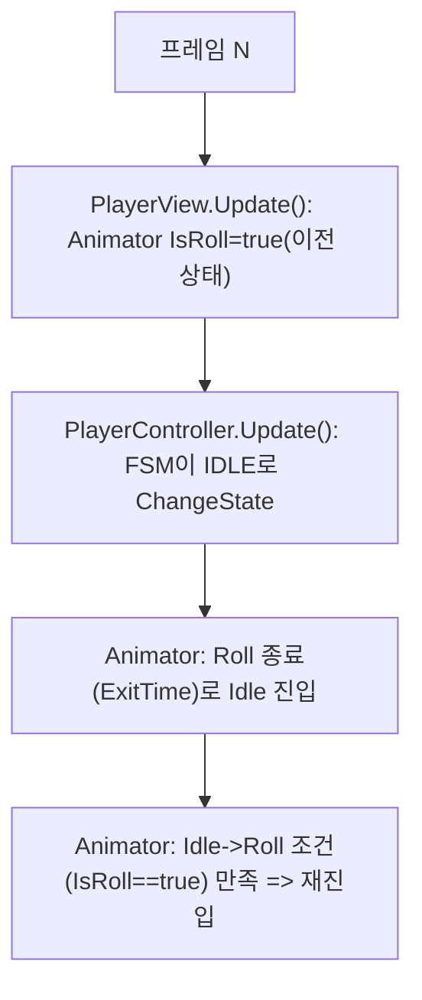
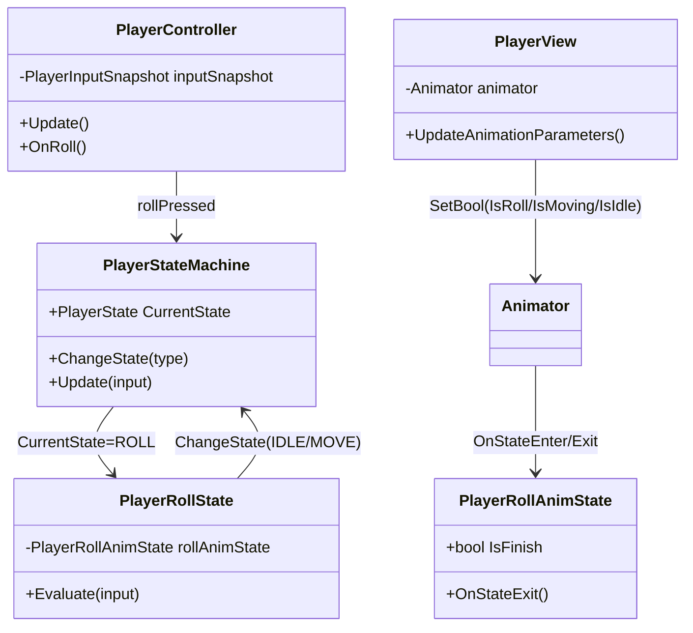
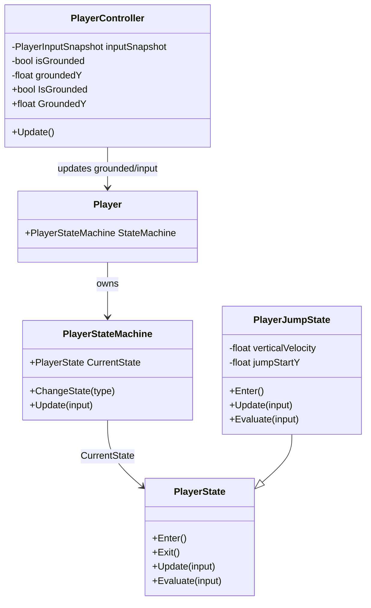
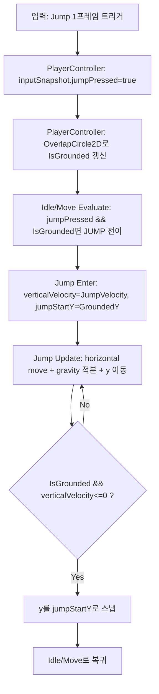

# [2026-04-23 13-39] us2d_client 웨폰 어태치먼트 데이터(WeaponAttachmentData) 파일 분리 및 에셋 스크립트 레퍼런스 복구 (SDP)

## 0) 구현 목표 (요약)
- **목표**: 현재 `WeaponAttachmentData.cs` 1개 파일에 몰려있는 `ScriptableObject` 데이터 타입들을 **클래스 1개 = 파일 1개**로 분리하여 유지보수성을 올립니다.
- **상용 기준(중요)**: Unity는 `.cs` 파일 단위로 `.meta GUID`를 통해 스크립트를 참조하므로, 단순 분리 시 **기존 `.asset/.prefab/.unity`의 스크립트 레퍼런스가 깨질 수 있음** → 이 작업에서는 **스크립트 파일 분리 + 관련 `.asset`의 `m_Script` 레퍼런스 복구까지 함께** 진행합니다.
- **범위**: 웨폰 어태치먼트 데이터 관련 코드/에셋만(불필요한 리팩터링/네이밍 변경 금지).

## 1) 현재 상태 (확인된 사실)
- 단일 파일: `D:\Devs\us2d_client\Assets\Projects\Scripts\Gameplay\Weapon\WeaponAttachmentData.cs`
  - 포함 클래스: `WeaponAttachmentSlot`, `WeaponAttachmentData`, `MagData`, `GripData`, `MuzzleData`, `BarrelAssemblyData`, `ScopeData`, `UpperBodyData`
  - 해당 스크립트 메타 GUID: `b8cc889ebd9aaf647a3624a54bdc3185` (`WeaponAttachmentData.cs.meta`)
- 리소스 에셋 2개가 **현재 `m_Script: {fileID: 0}`** 상태로 확인됨(=Unity에서 Missing Script 가능성 높음)
  - `D:\Devs\us2d_client\Assets\Projects\Resources\SO_Weapon_Pistol_BarrelAssembly_01.asset` (`Assembly-CSharp::BarrelAssemblyData`)
  - `D:\Devs\us2d_client\Assets\Projects\Resources\SO_Weapon.asset` (`Assembly-CSharp::ScopeData`)

## 2) 설계(접근 방식)
### 2.1. 파일 분리 원칙
- 클래스명/필드명/프로퍼티명은 **그대로 유지** (Unity 직렬화 안정성).
- 파일은 기존 폴더에 유지: `Assets/Projects/Scripts/Gameplay/Weapon/` (폴더 이동으로 인한 불필요한 메타/임포트 변동 최소화)
- 분리 후 목표 파일 구성:
  - `WeaponAttachmentSlot.cs`
  - `WeaponAttachmentData.cs` (base만 남김)
  - `MagData.cs`, `GripData.cs`, `MuzzleData.cs`, `BarrelAssemblyData.cs`, `ScopeData.cs`, `UpperBodyData.cs`

### 2.2. Unity 스크립트 레퍼런스(메타 GUID) 전략
- `WeaponAttachmentData.cs.meta`의 GUID(`b8cc889e...`)는 **그대로 유지**합니다.
- 새로 생성되는 `.cs`들에 대해 `.meta`를 **명시적으로 생성**하여 GUID를 고정합니다(상용/협업에서 재현성 확보).
  - `WeaponAttachmentSlot.cs.meta` GUID: `1f5093639a0949a398b4cf9293f08c58`
  - `MagData.cs.meta` GUID: `67d9b5a4abfd4b178d16ba4159309344`
  - `GripData.cs.meta` GUID: `c3bdb5d9039d43c89d6cf84921ec3c54`
  - `MuzzleData.cs.meta` GUID: `4129406d7f854ddcbba4c6e9eced03b9`
  - `BarrelAssemblyData.cs.meta` GUID: `ca73ccae3a634c62b84c549e1dc71842`
  - `ScopeData.cs.meta` GUID: `cd1fce0f7bdc492ab5d11b671b71825c`
  - `UpperBodyData.cs.meta` GUID: `92c404c738d8428cb4d506bcaf6938f1`

### 2.3. 에셋 레퍼런스 복구(필수)
- 분리 이후, 해당 타입을 쓰는 `.asset`에서 `m_Script: {fileID: 0}` → **정상 스크립트 레퍼런스**로 교체합니다.
  - `BarrelAssemblyData` 에셋은 `BarrelAssemblyData.cs.meta` GUID를 사용
  - `ScopeData` 에셋은 `ScopeData.cs.meta` GUID를 사용
- 형식:
  - `m_Script: {fileID: 11500000, guid: <script-guid>, type: 3}`

## 3) 로직 흐름(데이터 구조 관점)
1. `WeaponAttachmentData`는 `slots(List<WeaponAttachmentSlot>)`을 가짐
2. 각 `WeaponAttachmentSlot`은 `(Type, Data)`를 가짐
3. `Data`는 다른 `WeaponAttachmentData`(파생 포함)를 참조할 수 있어, “어태치먼트 트리/그래프”를 구성 가능

## 4) 수정/생성 파일 (경로)
### 4.1. 코드
- 수정: `D:\Devs\us2d_client\Assets\Projects\Scripts\Gameplay\Weapon\WeaponAttachmentData.cs`
- 생성: `D:\Devs\us2d_client\Assets\Projects\Scripts\Gameplay\Weapon\WeaponAttachmentSlot.cs`
- 생성: `D:\Devs\us2d_client\Assets\Projects\Scripts\Gameplay\Weapon\MagData.cs`
- 생성: `D:\Devs\us2d_client\Assets\Projects\Scripts\Gameplay\Weapon\GripData.cs`
- 생성: `D:\Devs\us2d_client\Assets\Projects\Scripts\Gameplay\Weapon\MuzzleData.cs`
- 생성: `D:\Devs\us2d_client\Assets\Projects\Scripts\Gameplay\Weapon\BarrelAssemblyData.cs`
- 생성: `D:\Devs\us2d_client\Assets\Projects\Scripts\Gameplay\Weapon\ScopeData.cs`
- 생성: `D:\Devs\us2d_client\Assets\Projects\Scripts\Gameplay\Weapon\UpperBodyData.cs`

### 4.2. 메타
- 생성: `D:\Devs\us2d_client\Assets\Projects\Scripts\Gameplay\Weapon\WeaponAttachmentSlot.cs.meta`
- 생성: `D:\Devs\us2d_client\Assets\Projects\Scripts\Gameplay\Weapon\MagData.cs.meta`
- 생성: `D:\Devs\us2d_client\Assets\Projects\Scripts\Gameplay\Weapon\GripData.cs.meta`
- 생성: `D:\Devs\us2d_client\Assets\Projects\Scripts\Gameplay\Weapon\MuzzleData.cs.meta`
- 생성: `D:\Devs\us2d_client\Assets\Projects\Scripts\Gameplay\Weapon\BarrelAssemblyData.cs.meta`
- 생성: `D:\Devs\us2d_client\Assets\Projects\Scripts\Gameplay\Weapon\ScopeData.cs.meta`
- 생성: `D:\Devs\us2d_client\Assets\Projects\Scripts\Gameplay\Weapon\UpperBodyData.cs.meta`

### 4.3. 에셋(YAML)
- 수정: `D:\Devs\us2d_client\Assets\Projects\Resources\SO_Weapon_Pistol_BarrelAssembly_01.asset`
- 수정: `D:\Devs\us2d_client\Assets\Projects\Resources\SO_Weapon.asset`

## 5) 구현 코드 (SDP에 전체 코드 포함)
### 5.1. `WeaponAttachmentSlot.cs`
대상: `D:\Devs\us2d_client\Assets\Projects\Scripts\Gameplay\Weapon\WeaponAttachmentSlot.cs`

```csharp
using System;

[Serializable]
public class WeaponAttachmentSlot
{
    public WeaponAttachmentType Type;
    public WeaponAttachmentData Data;
}
```

### 5.2. `WeaponAttachmentData.cs` (base만 유지)
대상: `D:\Devs\us2d_client\Assets\Projects\Scripts\Gameplay\Weapon\WeaponAttachmentData.cs`

```csharp
using System.Collections.Generic;
using UnityEngine;

public abstract class WeaponAttachmentData : ScriptableObject
{
    [field: SerializeField] public int Price { get; set; } = 0;

    [field: SerializeField] public List<WeaponAttachmentSlot> slots { get; set; } = new();
}
```

### 5.3. 파생 ScriptableObject 파일들
#### 5.3.1. `MagData.cs`
대상: `D:\Devs\us2d_client\Assets\Projects\Scripts\Gameplay\Weapon\MagData.cs`

```csharp
using UnityEngine;

[CreateAssetMenu(fileName = "MagData", menuName = "Scriptable Objects/Weapon Attachment/Mag")]
public class MagData : WeaponAttachmentData
{
    [Header("Setup")]
    [field: SerializeField] public int MaxAmmo { get; set; } = 0;
    [field: SerializeField] public float ReloadTimeRate { get; set; } = 0f;

    [Header("Sprite")]
    [field: SerializeField] public Sprite MagSprite { get; set; } = null;

    [Header("SFX")]
    [field: SerializeField] public AudioClip MagInSfx { get; set; } = null;
    [field: SerializeField] public AudioClip MagOutSfx { get; set; } = null;
    [field: SerializeField] public AudioClip MagDropSfx { get; set; } = null;
}
```

#### 5.3.2. `GripData.cs`
대상: `D:\Devs\us2d_client\Assets\Projects\Scripts\Gameplay\Weapon\GripData.cs`

```csharp
using UnityEngine;

[CreateAssetMenu(fileName = "GripData", menuName = "Scriptable Objects/Weapon Attachment/Grip")]
public class GripData : WeaponAttachmentData
{
    [Header("Setup")]
    [field: SerializeField] public float MoveSpeedRate { get; set; } = 1f;
}
```

#### 5.3.3. `MuzzleData.cs`
대상: `D:\Devs\us2d_client\Assets\Projects\Scripts\Gameplay\Weapon\MuzzleData.cs`

```csharp
using UnityEngine;

[CreateAssetMenu(fileName = "MuzzleData", menuName = "Scriptable Objects/Weapon Attachment/Muzzle")]
public class MuzzleData : WeaponAttachmentData
{
    [Header("Setup")]
    [field: SerializeField] public float RecoilRate { get; set; } = 1f;

    [Header("SFX")]
    [field: SerializeField] public AudioClip FireSfxOverride { get; set; } = null;
}
```

#### 5.3.4. `BarrelAssemblyData.cs`
대상: `D:\Devs\us2d_client\Assets\Projects\Scripts\Gameplay\Weapon\BarrelAssemblyData.cs`

```csharp
using UnityEngine;

[CreateAssetMenu(fileName = "BarrelAssemblyData", menuName = "Scriptable Objects/Weapon Attachment/BarrelAssembly")]
public class BarrelAssemblyData : WeaponAttachmentData
{
    [Header("Setup")]
    [field: SerializeField] public WeaponAttachmentBodyType BodyType { get; set; } = WeaponAttachmentBodyType.None;
    [field: SerializeField] public float RPM { get; set; } = 200f;
    [field: SerializeField] public float DamageRate { get; set; } = 1f;
}
```

#### 5.3.5. `ScopeData.cs`
대상: `D:\Devs\us2d_client\Assets\Projects\Scripts\Gameplay\Weapon\ScopeData.cs`

```csharp
using UnityEngine;

[CreateAssetMenu(fileName = "ScopeData", menuName = "Scriptable Objects/Weapon Attachment/Scope")]
public class ScopeData : WeaponAttachmentData
{
    [Header("Setup")]
    [field: SerializeField] public float AccuracyRate { get; set; } = 1f;
}
```

#### 5.3.6. `UpperBodyData.cs`
대상: `D:\Devs\us2d_client\Assets\Projects\Scripts\Gameplay\Weapon\UpperBodyData.cs`

```csharp
using UnityEngine;

[CreateAssetMenu(fileName = "UpperBodyData", menuName = "Scriptable Objects/Weapon Attachment/UpperBody")]
public class UpperBodyData : WeaponAttachmentData
{
}
```

### 5.4. `.meta` 파일(고정 GUID)
#### 5.4.1. `WeaponAttachmentSlot.cs.meta`
대상: `D:\Devs\us2d_client\Assets\Projects\Scripts\Gameplay\Weapon\WeaponAttachmentSlot.cs.meta`

```yaml
fileFormatVersion: 2
guid: 1f5093639a0949a398b4cf9293f08c58
```

#### 5.4.2. `MagData.cs.meta`
대상: `D:\Devs\us2d_client\Assets\Projects\Scripts\Gameplay\Weapon\MagData.cs.meta`

```yaml
fileFormatVersion: 2
guid: 67d9b5a4abfd4b178d16ba4159309344
```

#### 5.4.3. `GripData.cs.meta`
대상: `D:\Devs\us2d_client\Assets\Projects\Scripts\Gameplay\Weapon\GripData.cs.meta`

```yaml
fileFormatVersion: 2
guid: c3bdb5d9039d43c89d6cf84921ec3c54
```

#### 5.4.4. `MuzzleData.cs.meta`
대상: `D:\Devs\us2d_client\Assets\Projects\Scripts\Gameplay\Weapon\MuzzleData.cs.meta`

```yaml
fileFormatVersion: 2
guid: 4129406d7f854ddcbba4c6e9eced03b9
```

#### 5.4.5. `BarrelAssemblyData.cs.meta`
대상: `D:\Devs\us2d_client\Assets\Projects\Scripts\Gameplay\Weapon\BarrelAssemblyData.cs.meta`

```yaml
fileFormatVersion: 2
guid: ca73ccae3a634c62b84c549e1dc71842
```

#### 5.4.6. `ScopeData.cs.meta`
대상: `D:\Devs\us2d_client\Assets\Projects\Scripts\Gameplay\Weapon\ScopeData.cs.meta`

```yaml
fileFormatVersion: 2
guid: cd1fce0f7bdc492ab5d11b671b71825c
```

#### 5.4.7. `UpperBodyData.cs.meta`
대상: `D:\Devs\us2d_client\Assets\Projects\Scripts\Gameplay\Weapon\UpperBodyData.cs.meta`

```yaml
fileFormatVersion: 2
guid: 92c404c738d8428cb4d506bcaf6938f1
```

### 5.5. `.asset`의 `m_Script` 복구
#### 5.5.1. `SO_Weapon_Pistol_BarrelAssembly_01.asset`
대상: `D:\Devs\us2d_client\Assets\Projects\Resources\SO_Weapon_Pistol_BarrelAssembly_01.asset`

```diff
-  m_Script: {fileID: 0}
+  m_Script: {fileID: 11500000, guid: ca73ccae3a634c62b84c549e1dc71842, type: 3}
```

#### 5.5.2. `SO_Weapon.asset`
대상: `D:\Devs\us2d_client\Assets\Projects\Resources\SO_Weapon.asset`

```diff
-  m_Script: {fileID: 0}
+  m_Script: {fileID: 11500000, guid: cd1fce0f7bdc492ab5d11b671b71825c, type: 3}
```

## 6) 테스트(수동)
- Unity 열기 → 컴파일 에러 없음을 확인
- `Assets/Projects/Resources/`에서
  - `SO_Weapon_Pistol_BarrelAssembly_01`의 Inspector에 Missing Script가 아닌지 확인
  - `SO_Weapon`의 Inspector에 Missing Script가 아닌지 확인
- `Create > Scriptable Objects > Weapon Attachment > ...` 메뉴로 각 데이터 타입 생성이 정상 동작하는지 확인

---

## 7) 승인 체크박스
- [ ] Update: SDP 내용/가정 수정 요청
- [ ] Modify: 위 경로대로 **코드/메타/에셋** 실제 수정·생성 승인
- [ ] Test: Unity에서 수동 테스트까지 진행 승인

---

# [2026-04-22 15-24] us2d_client 스크립트 실행 순서 자동 설정(에디터 스크립트) 추가 (SDP)

## 0) 구현 목표 (요약)
- **목표**: Unity `Project Settings > Script Execution Order`에서 `PlayerController=1000`, `PlayerView=1999`를 **메뉴 한 번으로 자동 적용**.
- **배경**: 스크립트가 많아 수동 선택이 어려우므로, 에디터 스크립트에서 `MonoImporter.SetExecutionOrder`로 결정론적으로 설정.
- **상용 기준**: 신규 팀원/새 PC에서도 재현 가능하게 “도구화”하고, 누락 시 로그로 감지.

## 1) 설계(접근 방식)
- 파일은 사용자가 지정한 경로에 생성: `D:\Devs\us2d_client\Assets\Projects\Scripts\ScriptExecutionOrder.cs`
- 런타임 빌드에 포함되지 않도록 `#if UNITY_EDITOR` 가드로 Editor API를 감쌉니다.
- `MonoImporter.GetAllRuntimeMonoScripts()`를 순회하며 `GetClass()==typeof(T)`로 `MonoScript`를 찾아 적용(인스턴스 생성/부작용 방지).

## 2) 로직 흐름
1. Unity 메뉴 `Tools > Script Execution Order > Apply Player Order` 클릭
2. `PlayerController` 스크립트를 찾고 실행 순서 `1000` 적용
3. `PlayerView` 스크립트를 찾고 실행 순서 `1999` 적용
4. 성공/실패를 `Console`에 출력

## 3) 수정/생성 파일 (경로)
- 생성: `D:\Devs\us2d_client\Assets\Projects\Scripts\ScriptExecutionOrder.cs`

## 4) 구현 코드 (SDP에 전체 코드 포함)
대상: `D:\Devs\us2d_client\Assets\Projects\Scripts\ScriptExecutionOrder.cs`

```csharp
#if UNITY_EDITOR
using System;
using UnityEditor;
using UnityEngine;

public static class ScriptExecutionOrder
{
    [MenuItem("Tools/Script Execution Order/Apply Player Order")]
    private static void ApplyPlayerOrder()
    {
        Set<PlayerController>(1000);
        Set<PlayerView>(1999);

        Debug.Log("[ScriptExecutionOrder] Applied: PlayerController=1000, PlayerView=1999");
    }

    private static void Set<T>(int order) where T : MonoBehaviour
    {
        MonoScript monoScript = FindMonoScript(typeof(T));
        if (monoScript == null)
        {
            Debug.LogError($"[ScriptExecutionOrder] MonoScript not found: {typeof(T).FullName}");
            return;
        }

        MonoImporter.SetExecutionOrder(monoScript, order);
    }

    private static MonoScript FindMonoScript(Type type)
    {
        MonoScript[] scripts = MonoImporter.GetAllRuntimeMonoScripts();
        for (int i = 0; i < scripts.Length; i++)
        {
            MonoScript script = scripts[i];
            if (script == null) continue;

            if (script.GetClass() == type)
            {
                return script;
            }
        }

        return null;
    }
}
#endif
```

## 5) 테스트(수동)
- Unity에서 메뉴 실행 후 `Project Settings > Script Execution Order` 확인:
  - `PlayerController`가 `1000`
  - `PlayerView`가 `1999`

---

## 6) 승인 체크박스
- [ ] Update: SDP 내용/가정 수정 요청
- [ ] Modify: 위 경로로 에디터 스크립트 실제 생성 승인
- [ ] Test: 메뉴 실행 및 설정값 확인까지 진행 승인

---

# [2026-04-22 15-12] us2d_client 롤 종료 직후 Idle→Roll 재시작(재진입) 원인 분석 및 수정 (SDP)

## 0) 구현 목표 (요약)
- **증상**: 한번 구르기를 시작하면 **롤이 끝난 뒤 Idle로 갔다가 곧바로 다시 Roll을 시작**(=롤 애니가 연속으로 재시작되는 것처럼 보임).
- **목표**: Roll 종료 후 **입력(rollPressed)이 없으면 Roll 재시작이 절대 발생하지 않도록** 전이/파라미터를 결정론적으로 정리.

## 1) 현재 상태(확인된 사실)
### 1.1. AnimatorController 전이 구조(`AC_Player.controller`)
- `IsIdle` → `IsRoll` 전이 조건: `IsRoll == true` (ExitTime 없음)
- `IsMoving` → `IsRoll` 전이 조건: `IsRoll == true` (ExitTime 없음)
- `IsRoll` → `IsIdle` 전이: ExitTime=1, **조건 없음**
- `IsRoll` → `IsMoving` 전이: ExitTime=1, **조건 없음**

### 1.2. 파라미터 세팅 방식(`PlayerView`)
- `Update()`에서 매 프레임 `Animator.SetBool(IsIdle/IsMoving/IsRoll)`을 `player.StateMachine.CurrentState.StateType` 기준으로 설정.

## 2) 원인(가장 유력)
### 2.1. “한 프레임 stale” 파라미터로 인해 Idle에서 Roll이 재발동
Unity는 같은 프레임 안에서 `MonoBehaviour.Update()` 호출 순서가 고정 보장되지 않습니다(프로젝트 Script Execution Order를 따로 설정하지 않는 한).
- 어떤 프레임에서 Roll이 끝나며 `PlayerRollState.Evaluate()`가 `PlayerStateMachine.ChangeState(IDLE)`을 호출하더라도,
- 같은 프레임의 `PlayerView.Update()`가 **그보다 먼저 실행**되면,
  - `IsRoll` 파라미터는 그 프레임 동안 계속 **true(이전 상태 기준)** 로 남을 수 있습니다.
- 그 상태에서 Animator는 Roll→Idle(ExitTime)로 빠져나온 직후, Idle→Roll 조건(`IsRoll == true`)을 만족해 **곧바로 Roll을 다시 시작**할 수 있습니다.

즉, **게임플레이 FSM은 Idle로 복귀했는데, Animator 파라미터가 한 프레임 늦게 갱신되어** 애니메이션만 다시 롤로 재진입하는 현상입니다.

## 3) 수정 방안(권장 우선순위)
### 3.1. (권장 1) Script Execution Order를 코드로 고정
가장 작은 변경으로 “동일 프레임 내 순서”를 보장합니다.
- `PlayerController`가 `Update()`에서 FSM 업데이트를 먼저 수행
- `PlayerView`가 그 다음 `Update()`에서 Animator 파라미터 반영

구현:
- `PlayerController`에 `[DefaultExecutionOrder(-100)]`
- `PlayerView`에 `[DefaultExecutionOrder(100)]`

### 3.2. (권장 2) Animator 파라미터 업데이트를 `PlayerController.Update()`로 이동
View가 “게임 상태를 읽어 애니 파라미터를 쓰는” 시점을 명시적으로 FSM 업데이트 직후로 고정합니다.
- `PlayerView.Update()`에서는 Flip만 유지
- `PlayerController.Update()`에서 `player.StateMachine.Update(...)` 직후 `playerView.UpdateAnimationParameters()` 호출

### 3.3. (추가 안정화) `AC_Player.controller`의 Roll 종료 전이를 결정론적으로
현재 `IsRoll` 상태에 ExitTime=1 전이가 2개(`IsIdle`, `IsMoving`)인데 조건이 비어있어 결과가 비결정적일 수 있습니다.
- `IsRoll` → `IsMoving`: `IsMoving == true`
- `IsRoll` → `IsIdle`: `IsMoving == false`
- ExitTime=1 유지

## 4) 다이어그램(프레임 순서 문제)


## 5) 수정/생성 파일(경로)
- 수정(권장): `D:\Devs\us2d_client\Assets\Projects\Scripts\Gameplay\PlayerController.cs`
- 수정(권장): `D:\Devs\us2d_client\Assets\Projects\Scripts\Gameplay\PlayerView.cs`
- 수정(추가 안정화): `D:\Devs\us2d_client\Assets\Projects\Anims\Gameplay\AC_Player.controller`

## 6) 구현 코드(승인 후 실제 반영)
### 6.1. `DefaultExecutionOrder` 적용(권장 1)
대상: `D:\Devs\us2d_client\Assets\Projects\Scripts\Gameplay\PlayerController.cs`
```csharp
using UnityEngine;

[DefaultExecutionOrder(-100)]
public partial class PlayerController : MonoBehaviour, InputMappingContext.IPlayerActions
{
    // ...
}
```

대상: `D:\Devs\us2d_client\Assets\Projects\Scripts\Gameplay\PlayerView.cs`
```csharp
using UnityEngine;

[DefaultExecutionOrder(100)]
public class PlayerView : MonoBehaviour
{
    // ...
}
```

### 6.2. (옵션) Roll 종료 전이 조건화(추가 안정화)
대상: `D:\Devs\us2d_client\Assets\Projects\Anims\Gameplay\AC_Player.controller`
- `IsRoll -> IsIdle` 전이 조건: `IsMoving == false`
- `IsRoll -> IsMoving` 전이 조건: `IsMoving == true`

## 7) 테스트(수동)
- Roll 1회 입력 → Roll 완료 → Idle/Move 복귀 후 **Roll이 자동 재시작하지 않음**
- Roll 끝나는 순간에 이동 입력 유지/해제 두 케이스 확인

---

## 8) 승인 체크박스
- [ ] Update: SDP 내용/가정/다이어그램 수정 요청
- [ ] Modify: `PlayerController/PlayerView`(및 필요 시 `AC_Player.controller`) 실제 수정 승인
- [ ] Test: 유니티 플레이모드(수동) 테스트까지 진행 승인

---

# [2026-04-22 14-45] us2d_client 플레이어 구르기(ROLL) 애니메이션 “미재생/정지” 원인 분석 및 수정 (SDP)

## 0) 구현 목표 (요약)
- **증상**: 플레이 중 플레이어가 구르기 입력을 해도 **Roll 애니메이션이 안 보이거나**, 보이더라도 **프레임이 진행되지 않는 것처럼** 보임(=롤이 끝나지 않고 상태가 고착되는 느낌).
- **목표**: Roll 애니메이션이 **정상 재생/종료**되고, 종료 시 `PlayerStateMachine`이 `IDLE/MOVE`로 **정상 복귀**하도록 수정.
- **상용 기준**: “설정 실수로 롤이 영구 고착” 같은 장애가 나지 않게, **Animator 전이/파라미터 설계**를 결정론적으로 정리하고, 필요 시 **코드 fallback**도 준비.

## 1) 현상 관찰 체크(1분 컷)
아래 중 어느 케이스인지에 따라 원인이 갈립니다.
- (A) **Idle/Move 애니도 전부 안 보임** → Animator/Renderer/레이어/컨트롤러 자체 문제 가능성
- (B) **Idle/Move는 정상인데 Roll만 문제** → Roll 전이(AnyState) 또는 Roll 상태 자체 설정 문제 가능성 큼

※ 현재 프로젝트 파일 기준으로는 (B)가 더 유력합니다.

## 2) 현재 구조(코드) 요약
- 입력: `PlayerController`에서 `rollPressed` 1프레임 true → `PlayerIdleState/PlayerMoveState.Evaluate()`에서 `ROLL`로 전이.
- 뷰: `PlayerView.UpdateAnimationParameters()`에서 상태에 따라 Animator bool(`IsIdle/IsMoving/IsRoll`)을 **매 프레임 SetBool**.
- 롤 종료 감지: `PlayerRollState`가 `Animator.GetBehaviour<PlayerRollAnimState>()`의 `IsFinish`를 보고 `IDLE/MOVE`로 전이.

## 3) 원인 분석(가장 유력한 1순위)
### 3.1. `AC_Player.controller`의 AnyState→Roll 전이가 “자기 자신(Roll)으로도 전이 가능”하게 설정됨
`Assets/Projects/Anims/Gameplay/AC_Player.controller`에서:
- AnyState→Roll 조건은 `IsRoll == true`
- 그런데 `PlayerView`는 플레이어가 `ROLL` 상태인 동안 `IsRoll`을 **계속 true**로 유지
- 게다가 AnyState 전이의 `Can Transition To Self`가 켜져 있으면(=자기 자신으로도 전이 가능),
  - Roll 상태에 들어간 직후에도 **매 프레임 AnyState→Roll이 다시 발동**
  - 결과적으로 Roll이 매 프레임 재진입(리셋)되어 **normalizedTime이 1.0에 도달하지 못하고**, `OnStateExit`가 기대대로 발생하지 않거나(혹은 계속 리셋) “진행이 안 되는 것처럼” 보일 수 있습니다.
  - 그러면 `PlayerRollAnimState.IsFinish`도 true가 되지 않아 `PlayerRollState`가 빠져나가지 못해 **FSM도 고착**될 수 있습니다.

### 3.2. Roll→Idle / Roll→Move 전이가 “조건이 비어있어” 비결정적
현재 Roll state에는 (ExitTime=1)인 전이가 **2개** 있는데 조건이 둘 다 비어있습니다.
- Roll이 끝난 뒤 어디로 갈지(Idle/Move)가 컨트롤러 내부 순서/평가에 따라 달라질 수 있어 디버깅이 어려워집니다.

## 4) 수정 방안(권장: 설정 수정이 1순위, 코드 수정은 2순위)
### 4.1. (필수) AnyState→Roll 전이에서 `Can Transition To Self`를 끔
- Roll 상태에서 `IsRoll`이 계속 true여도, **Roll→Roll 재진입**이 막혀 애니메이션이 정상 진행합니다.

### 4.2. (필수) Roll→Idle / Roll→Move 전이에 조건을 부여
- Roll→Move: `IsMoving == true`
- Roll→Idle: `IsMoving == false`
- ExitTime(=Roll 애니 1회 재생 후 종료)은 유지.

### 4.3. (선택, 상용 안정성) 코드 fallback 추가
Animator 설정이 다시 잘못되더라도 “롤 영구 고착”은 막아야 합니다.
- `PlayerRollState`에서 `rollAnimState == null` 또는 일정 시간(예: 0.8s) 초과 시 **강제 종료**(Idle/Move)로 빠져나오기.

## 5) 다이어그램(클래스/흐름)
### 5.1. 클래스 구조(요약)


### 5.2. 로직 흐름(문제 케이스 포함)
```mermaid
flowchart TD
  I[입력: Roll] --> C[PlayerController: rollPressed 1프레임]
  C --> S0[PlayerStateMachine: ROLL 전이]
  S0 --> V[PlayerView: IsRoll=true 매 프레임]
  V --> A[Animator: AnyState->Roll (IsRoll 조건)]
  A -->|CanTransitionToSelf=ON| A2[Roll->Roll 재진입 반복(리셋)]
  A2 --> F0[Roll 애니 진행/종료 불가처럼 보임]
  F0 --> F1[PlayerRollAnimState.IsFinish=true 안 됨]
  F1 --> F2[PlayerRollState.Evaluate: ROLL에서 못 빠짐]
```

## 6) 수정/생성 파일(경로)
### 6.1. 실제 수정(권장)
- 수정: `D:\Devs\us2d_client\Assets\Projects\Anims\Gameplay\AC_Player.controller`

### 6.2. 선택(안정성 강화)
- 수정: `D:\Devs\us2d_client\Assets\Projects\Scripts\Gameplay\Creature\States\PlayerRollState.cs`

## 7) 구현 코드(적용 예정 패치; 승인 후 실제 반영)
### 7.1. `AC_Player.controller` (AnyState→Roll self 전이 차단 + Roll 종료 전이 조건화)
대상: `D:\Devs\us2d_client\Assets\Projects\Anims\Gameplay\AC_Player.controller`

#### (1) AnyState→Roll 전이: `m_CanTransitionToSelf: 1` → `0`
```diff
--- !u!1101 &-1951435611704114310
 AnimatorStateTransition:
@@
-  m_CanTransitionToSelf: 1
+  m_CanTransitionToSelf: 0
```

#### (2) Roll→Idle 전이(ExitTime 유지 + `IsMoving == false`)
```diff
--- !u!1101 &-8966140963237354498
 AnimatorStateTransition:
@@
-  m_Conditions: []
+  m_Conditions:
+  - m_ConditionMode: 2
+    m_ConditionEvent: IsMoving
+    m_EventTreshold: 0
```

#### (3) Roll→Move 전이(ExitTime 유지 + `IsMoving == true`)
```diff
--- !u!1101 &-5285520995236260385
 AnimatorStateTransition:
@@
-  m_Conditions: []
+  m_Conditions:
+  - m_ConditionMode: 1
+    m_ConditionEvent: IsMoving
+    m_EventTreshold: 0
```

### 7.2. (선택) `PlayerRollState` fallback(롤 고착 방지)
대상: `D:\Devs\us2d_client\Assets\Projects\Scripts\Gameplay\Creature\States\PlayerRollState.cs`

핵심 아이디어:
- `Enter()`에서 `rollStartTime = Time.time;`
- `Evaluate()`에서
  - `rollAnimState != null && rollAnimState.IsFinish`면 정상 종료
  - 아니면 `Time.time - rollStartTime >= RollMaxDurationSeconds`면 강제 종료(Idle/Move)

```diff
 public class PlayerRollState : PlayerState
 {
     private PlayerRollAnimState rollAnimState;
+    private float rollStartTime;
+    private const float RollMaxDurationSeconds = 0.8f;
@@
     public PlayerRollState(Player player) : base(player, PlayerStateType.ROLL)
     {
         rollAnimState = Utls.FindComponent<Animator>(player.gameObject).GetBehaviour<PlayerRollAnimState>();
     }
+
+    public override void Enter()
+    {
+        rollStartTime = Time.time;
+    }
@@
     public override void Evaluate(PlayerInputSnapshot input)
     {
-        if (rollAnimState.IsFinish == true)
+        bool isRollFinished = rollAnimState != null && rollAnimState.IsFinish;
+        bool isTimeout = Time.time - rollStartTime >= RollMaxDurationSeconds;
+
+        if (isRollFinished || isTimeout)
         {
             Player.StateMachine.ChangeState(input.move.IsNearlyZero() ? PlayerStateType.IDLE : PlayerStateType.MOVE);
             return;
         }
     }
 }
```

## 8) 테스트(수동) 시나리오
- (1) Idle에서 Roll → Roll 애니가 **끝까지 진행** 후 Idle 복귀
- (2) Move 중 Roll(이동 입력 유지) → Roll 애니 진행 후 Move 복귀
- (3) Roll 연타 → 애니가 매 프레임 리셋되지 않고, 기대 동작(쿨타임/연타 정책)에 맞게 동작
- (4) 콘솔에 Animator 파라미터 미존재 경고/NullRef가 없는지 확인

## 9) 리스크/롤백
- 애니 컨트롤러(YAML) 수정은 머지 충돌이 잦습니다 → 수정 후 `AC_Player.controller`만 단독 커밋/PR로 분리 권장.
- 롤백은 `AC_Player.controller`를 수정 전 버전으로 되돌리면 됩니다.

---

## 10) 승인 체크박스
- [ ] Update: SDP 내용/가정/다이어그램 수정 요청
- [ ] Modify: 위 수정안(AnimatorController 및 선택 코드) 실제 반영 승인
- [ ] Test: 유니티 플레이모드(수동) 테스트까지 진행 승인

---

# [2026-04-24 09-22] us2d_client 플레이어 JumpState 구현(그라운드 체크 + 입력 + 애니 파라미터 연동) (SDP)

## 0) 구현 목표 (요약)
- **목표**: 현재 비어있는 `PlayerJumpState`를 다른 스테이트(`Idle/Move/Roll`) 구조와 동일한 패턴으로 구현하고, **그라운드 체크를 `PlayerController`에서 `Physics2D.OverlapCircle`로 제공**하여 점프 시작/착지를 결정합니다.
- **상용 기준(중요)**:
  - 입력/상태/애니메이션이 서로 “한 프레임짜리 트리거 + 지속 파라미터” 패턴으로 안정적으로 동작해야 함.
  - 생성 코드/자동생성 파일(`InputMappingContext.cs`)은 **가급적 수정하지 않고**, 런타임 `FindAction`로 점프 액션을 연결해 리젠/머지 리스크를 줄임.

## 1) 현재 상태 (확인된 사실)
- `D:\Devs\us2d_client\Assets\Projects\Scripts\Gameplay\Creature\States\PlayerJumpState.cs`가 **빈 클래스**입니다.
- `PlayerStateType`에 **JUMP가 정의되어 있지 않고**, `PlayerStateMachine`에도 JumpState가 등록되어 있지 않습니다.
- `D:\Devs\us2d_client\Assets\Projects\Anims\Gameplay\AC_Player.controller`에 Animator Bool 파라미터 `IsJump`가 존재합니다(컨트롤러 내 조건 이벤트로 확인됨).
- 입력 시스템(`Assets/Projects/Inputs/InputMappingContext.inputactions`)에 `Jump` 액션이 아직 없습니다.
- 플레이어 프리팹 `D:\Devs\us2d_client\Assets\Projects\Prefabs\PF_Player.prefab`에는 `BoxCollider2D`(Trigger)가 있으며, 현재 코드 기준으로는 점프/그라운드 체크용 별도 트랜스폼이 없습니다.

## 2) 설계(접근 방식)

### 2.1. 상태머신 확장
- `PlayerStateType`에 `JUMP`를 추가합니다(기존 값 유지 + 신규 값만 추가).
- `PlayerStateMachine.Init()`에서 `PlayerJumpState`를 등록합니다.
- `PlayerIdleState`/`PlayerMoveState`의 `Evaluate()`에 점프 전이 조건을 추가합니다.

### 2.2. 입력(점프 트리거) 전략
- `InputMappingContext.inputactions`에 `Jump` 액션을 추가하고 기본 바인딩을 제공합니다.
  - Keyboard: `Space`
  - Gamepad: `buttonSouth(A)`
- `InputMappingContext.cs`(자동 생성)는 수정하지 않는 방향으로 갑니다.
  - `PlayerController`가 런타임에 `InputManager.InputMappingContext.asset.FindAction("Player/Jump", true)`로 액션을 찾아 이벤트를 구독합니다.

### 2.3. 그라운드 체크는 PlayerController에서 제공
- `PlayerController`가 매 프레임(또는 Update 주기) `Physics2D.OverlapCircle`로 `IsGrounded`를 갱신합니다.
- 점프 상태는 `PlayerController.IsGrounded`를 참조해 착지 여부를 판단합니다.

### 2.4. 점프 물리(상용 최소 구현)
- Rigidbody2D를 강제하지 않고, 기존 스테이트들과 동일하게 **transform 기반(키네마틱) 이동**으로 구현합니다.
- 수직 속도(`verticalVelocity`)와 중력(`gravity`)을 통해 `y`축 이동을 적분합니다.
- 착지 시 `y`를 “점프 시작 시점의 지면 높이(캐시)”로 스냅하여 잔진동/부유를 줄입니다.

## 3) 클래스/레이어 구조(요약)

### 3.1. 클래스 다이어그램(요약)


### 3.2. 로직 흐름(점프)


## 4) 수정/생성 파일 (경로)
### 4.1. 코드(수정)
- `D:\Devs\us2d_client\Assets\Projects\Scripts\Gameplay\Creature\States\PlayerState.cs`
- `D:\Devs\us2d_client\Assets\Projects\Scripts\Gameplay\Creature\States\PlayerStateMachine.cs`
- `D:\Devs\us2d_client\Assets\Projects\Scripts\Gameplay\Creature\States\PlayerIdleState.cs`
- `D:\Devs\us2d_client\Assets\Projects\Scripts\Gameplay\Creature\States\PlayerMoveState.cs`
- `D:\Devs\us2d_client\Assets\Projects\Scripts\Gameplay\Creature\States\PlayerJumpState.cs`
- `D:\Devs\us2d_client\Assets\Projects\Scripts\Gameplay\PlayerController.cs`
- `D:\Devs\us2d_client\Assets\Projects\Scripts\Gameplay\PlayerView.cs`
- `D:\Devs\us2d_client\Assets\Projects\Scripts\Gameplay\PlayerData.cs`
- `D:\Devs\us2d_client\Assets\Projects\Inputs\InputMappingContext.inputactions`

### 4.2. 다이어그램(저장 위치)
- `C:\Users\morex\OneDrive\Documents\Obsidian Vault\diagram\[2026-04-24 09-22] us2d_client Player Jump State 다이어그램.md`

## 5) 단계별 구현 순서
1. `PlayerStateType`에 `JUMP` 추가 + `PlayerStateMachine`에 JumpState 등록
2. `PlayerInputSnapshot`에 `jumpPressed` 추가 + `PlayerController`에 Jump 액션 구독/해제 추가
3. `PlayerController`에 GroundCheck(OverlapCircle2D) 구현 + Gizmo 표시
4. `PlayerData`에 점프 파라미터 추가(기본값 포함)
5. `PlayerJumpState` 구현(Enter/Update/Evaluate) + Idle/Move 전이 조건 추가
6. `PlayerView`가 Animator `IsJump`를 세팅하도록 연동

## 6) 구현 코드(적용 예정 패치; 승인 후 실제 반영)

### 6.1. `PlayerState.cs` (JUMP 추가)
대상: `D:\Devs\us2d_client\Assets\Projects\Scripts\Gameplay\Creature\States\PlayerState.cs`
```diff
 public enum PlayerStateType
 {
     NONE = 0,
     IDLE = 1,
     MOVE = 2,
     ROLL = 3,
     DEAD = 4
+    ,JUMP = 5
 }
```

### 6.2. `PlayerStateMachine.cs` (JumpState 등록)
대상: `D:\Devs\us2d_client\Assets\Projects\Scripts\Gameplay\Creature\States\PlayerStateMachine.cs`
```diff
 private void Init(Player player)
 {
     states.Add(PlayerStateType.IDLE, new PlayerIdleState(player));
     states.Add(PlayerStateType.MOVE, new PlayerMoveState(player));
     states.Add(PlayerStateType.ROLL, new PlayerRollState(player));
+    states.Add(PlayerStateType.JUMP, new PlayerJumpState(player));
     states.Add(PlayerStateType.DEAD, new PlayerDeadState(player));
 }
```

### 6.3. `PlayerController.cs` (Jump 입력 + GroundCheck)
대상: `D:\Devs\us2d_client\Assets\Projects\Scripts\Gameplay\PlayerController.cs`

#### (1) 스냅샷 필드 추가
```diff
 public struct PlayerInputSnapshot
 {
     // Trigger
     public bool firePressed;
     public bool rollPressed;
     public bool reloadPressed;
+    public bool jumpPressed;
 }
```

#### (2) GroundCheck 필드/프로퍼티 추가 + Update에서 갱신
```diff
 public partial class PlayerController : MonoBehaviour, InputMappingContext.IPlayerActions
 {
+    [Header("Ground Check")]
+    [SerializeField] private Transform groundCheck = null;
+    [SerializeField] private float groundCheckRadius = 0.08f;
+    [SerializeField] private LayerMask groundLayerMask = ~0;
+
+    public bool IsGrounded { get; private set; } = true;
+    public float GroundedY { get; private set; } = 0f;
+    private InputAction jumpAction = null;
 
     private void Update()
     {
+        UpdateGrounded();
         player.StateMachine.Update(inputSnapshot.Consume());
     }
+
+    private void UpdateGrounded()
+    {
+        Vector2 checkPos = groundCheck != null
+            ? (Vector2)groundCheck.position
+            : (Vector2)transform.position + Vector2.down * 0.25f;
+
+        Collider2D hit = Physics2D.OverlapCircle(checkPos, groundCheckRadius, groundLayerMask);
+        IsGrounded = hit != null;
+        if (IsGrounded) GroundedY = transform.position.y;
+    }
 }
```

#### (3) 점프 액션 구독(자동 생성 코드 수정 없이 FindAction 사용)
```diff
 private void OnEnable()
 {
     InputManager.InputMappingContext.Player.Move.performed += OnMove;
     InputManager.InputMappingContext.Player.Move.canceled += OnMove;
     InputManager.InputMappingContext.Player.Look.performed += OnLook;
     InputManager.InputMappingContext.Player.Look.canceled += OnLook;
     InputManager.InputMappingContext.Player.Fire.performed += OnFire;
     InputManager.InputMappingContext.Player.Roll.performed += OnRoll;
     InputManager.InputMappingContext.Player.Reload.performed += OnReload;
+
+    jumpAction = InputManager.InputMappingContext.asset.FindAction("Player/Jump", true);
+    if (jumpAction != null) jumpAction.performed += OnJump;
 }
 
 private void OnDisable()
 {
     InputManager.InputMappingContext.Player.Move.performed -= OnMove;
     InputManager.InputMappingContext.Player.Move.canceled -= OnMove;
     InputManager.InputMappingContext.Player.Look.performed -= OnLook;
     InputManager.InputMappingContext.Player.Look.canceled -= OnLook;
     InputManager.InputMappingContext.Player.Fire.performed -= OnFire;
     InputManager.InputMappingContext.Player.Roll.performed -= OnRoll;
     InputManager.InputMappingContext.Player.Reload.performed -= OnReload;
+
+    if (jumpAction != null) jumpAction.performed -= OnJump;
+    jumpAction = null;
 }
```

#### (4) 점프 트리거 처리 메서드 추가
```diff
 public partial class PlayerController
 {
+    public event Action OnJumpTriggered;
+
+    public void OnJump(InputAction.CallbackContext context)
+    {
+        inputSnapshot.jumpPressed = true;
+        OnJumpTriggered?.Invoke();
+    }
 }
```

#### (5) Gizmo 표시(선택)
```diff
 private void OnDrawGizmos()
 {
     Gizmos.color = Color.green;
     Gizmos.DrawLine(player.transform.position, player.transform.position + player.MoveDirection);
+
+    Gizmos.color = IsGrounded ? Color.cyan : Color.red;
+    Vector3 pos = groundCheck != null ? groundCheck.position : transform.position + Vector3.down * 0.25f;
+    Gizmos.DrawWireSphere(pos, groundCheckRadius);
 }
```

### 6.4. `InputMappingContext.inputactions` (Jump 액션 추가)
대상: `D:\Devs\us2d_client\Assets\Projects\Inputs\InputMappingContext.inputactions`

핵심 변경:
- Player action map의 `actions`에 Jump 추가
- Player map의 `bindings`에 Space/Gamepad-A 바인딩 추가

예시(개념; 실제 적용 시 JSON 내 id는 새로 생성):
```diff
   "actions": [
+    { "name": "Jump", "type": "Button", "id": "<new-guid>", "expectedControlType": "Button", "processors": "", "interactions": "", "initialStateCheck": false },
     ...
   ],
   "bindings": [
+    { "name": "", "id": "<new-guid>", "path": "<Keyboard>/space", "interactions": "", "processors": "", "groups": "Keyboard&Mouse", "action": "Jump", "isComposite": false, "isPartOfComposite": false },
+    { "name": "", "id": "<new-guid>", "path": "<Gamepad>/buttonSouth", "interactions": "", "processors": "", "groups": "Gamepad", "action": "Jump", "isComposite": false, "isPartOfComposite": false },
     ...
   ]
```

### 6.5. `PlayerData.cs` (점프 파라미터 추가)
대상: `D:\Devs\us2d_client\Assets\Projects\Scripts\Gameplay\PlayerData.cs`
```diff
 public class PlayerData : CreatureData
 {
     [field: SerializeField] public float RollSpCost { get; set; } = 25f;
     [field: SerializeField] public float SpeedAccelAtRollMultiplier { get; set; } = 3f;
     [field: SerializeField] public float SpeedDecelAtRollMultiplier { get; set; } = 0.3f;
+
+    [field: Header("Jump")]
+    [field: SerializeField] public float JumpVelocity { get; set; } = 6.5f;
+    [field: SerializeField] public float JumpGravity { get; set; } = -18f;
+    [field: SerializeField] public float AirControlMultiplier { get; set; } = 0.85f;
 }
```

### 6.6. `PlayerIdleState.cs` / `PlayerMoveState.cs` (Jump 전이)
대상:
- `D:\Devs\us2d_client\Assets\Projects\Scripts\Gameplay\Creature\States\PlayerIdleState.cs`
- `D:\Devs\us2d_client\Assets\Projects\Scripts\Gameplay\Creature\States\PlayerMoveState.cs`

```diff
 public override void Evaluate(PlayerInputSnapshot inputSnapshot)
 {
     if (Player.CurrentHp <= 0f) { ... }
+
+    PlayerController controller = Utls.FindComponent<PlayerController>(Player.gameObject);
+    if (inputSnapshot.jumpPressed && controller != null && controller.IsGrounded)
+    {
+        Player.StateMachine.ChangeState(PlayerStateType.JUMP);
+        return;
+    }
 
     if (inputSnapshot.rollPressed) { ... }
     ...
 }
```

### 6.7. `PlayerJumpState.cs` (본체 구현)
대상: `D:\Devs\us2d_client\Assets\Projects\Scripts\Gameplay\Creature\States\PlayerJumpState.cs`

```diff
 using UnityEngine;
 
 public class PlayerJumpState : PlayerState
 {
     private PlayerController controller;
     private float verticalVelocity;
     private float jumpStartY;
 
     public PlayerJumpState(Player player) : base(player, PlayerStateType.JUMP)
     {
         controller = Utls.FindComponent<PlayerController>(player.gameObject);
     }
 
     public override void Enter()
     {
         if (controller != null)
             jumpStartY = controller.GroundedY;
         else
             jumpStartY = Player.transform.position.y;
 
         verticalVelocity = Player.Data.JumpVelocity;
     }
 
     public override void Update(PlayerInputSnapshot inputSnapshot)
     {
         SetMoveDirection(inputSnapshot);
         SetLookDirection(inputSnapshot);
 
         MoveHorizontal(inputSnapshot);
         ApplyGravityAndMoveVertical();
     }
 
     private void SetMoveDirection(PlayerInputSnapshot inputSnapshot)
     {
         if (inputSnapshot.move.IsNearlyZero()) return;
 
         Vector3 input = inputSnapshot.move.normalized;
         Player.MoveDirection = new Vector3(input.x, 0, input.y);
     }
 
     private void SetLookDirection(PlayerInputSnapshot inputSnapshot)
     {
         if (inputSnapshot.look.IsNearlyZero()) return;
 
         Player.LookDirection = (Utls.GetMouseWorldPosition() - Player.transform.position).normalized;
     }
 
     private void MoveHorizontal(PlayerInputSnapshot inputSnapshot)
     {
         Vector3 frameVelocity = new Vector3
         (
             Player.MoveDirection.x * Player.Data.MaxSpeed.x,
             0,
             Player.MoveDirection.z * Player.Data.MaxSpeed.z
         );
 
         float airControl = Player.Data.AirControlMultiplier;
         Player.transform.position += frameVelocity * airControl * Time.deltaTime;
     }
 
     private void ApplyGravityAndMoveVertical()
     {
         verticalVelocity += Player.Data.JumpGravity * Time.deltaTime;
         Vector3 pos = Player.transform.position;
         pos.y += verticalVelocity * Time.deltaTime;
         Player.transform.position = pos;
     }
 
     public override void Evaluate(PlayerInputSnapshot inputSnapshot)
     {
         if (Player.CurrentHp <= 0f)
         {
             Player.StateMachine.ChangeState(PlayerStateType.DEAD);
             return;
         }
 
         bool isGrounded = controller != null && controller.IsGrounded;
         if (isGrounded && verticalVelocity <= 0f)
         {
             Vector3 pos = Player.transform.position;
             pos.y = jumpStartY;
             Player.transform.position = pos;
 
             Player.StateMachine.ChangeState(inputSnapshot.move.IsNearlyZero() ? PlayerStateType.IDLE : PlayerStateType.MOVE);
             return;
         }
     }
 
     public override bool CanTransitTo(PlayerStateType nextStateType)
     {
         // 공중에서 구르기 같은 의도치 않은 상태 전이 방지(필요 시 정책 변경)
         if (nextStateType == PlayerStateType.ROLL) return false;
         return true;
     }
 }
```

### 6.8. `PlayerView.cs` (IsJump 연동)
대상: `D:\Devs\us2d_client\Assets\Projects\Scripts\Gameplay\PlayerView.cs`
```diff
 public void UpdateAnimationParameters()
 {
     animator.SetBool(UnityConstant.Animator.Parameters.AC_Player.Bool.IsIdle,  ... );
     animator.SetBool(UnityConstant.Animator.Parameters.AC_Player.Bool.IsMoving, ... );
     animator.SetBool(UnityConstant.Animator.Parameters.AC_Player.Bool.IsRoll,  ... );
+
+    // UnityConstant 쪽에 IsJump 상수가 없을 가능성을 고려해 문자열을 사용(필요 시 상수로 교체)
+    animator.SetBool("IsJump", player.StateMachine.CurrentState.StateType == PlayerStateType.JUMP);
 }
```

## 7) 테스트(수동) 시나리오
- (1) Idle에서 Space → 점프 애니( IsJump=true )로 전이, 착지 후 Idle 복귀
- (2) Move 중 Space → 점프 중에도 수평 이동 가능(air control), 착지 후 Move 복귀
- (3) 공중에서 Space 연타 → 2중 점프가 발생하지 않음(grounded 조건)
- (4) 공중에서 Roll 입력 → 정책대로 무시되거나(현재 설계: 무시) 에러 없이 동작
- (5) GroundCheck radius/레이어 세팅이 잘못되었을 때도 NullRef 없이 안정적으로 동작

## 8) 리스크/롤백
- 입력 에셋(`.inputactions`) 변경은 Unity에서 리임포트 시 자동 코드 생성/바인딩 재정렬이 발생할 수 있음 → 이번 설계는 **자동 생성 C# 수정 없이** 런타임 FindAction을 사용해 영향 최소화.
- 롤백은 아래 파일들을 원복하면 됨:
  - `PlayerState.cs`, `PlayerStateMachine.cs`, `PlayerIdleState.cs`, `PlayerMoveState.cs`, `PlayerJumpState.cs`, `PlayerController.cs`, `PlayerView.cs`, `PlayerData.cs`, `InputMappingContext.inputactions`

---

## 9) 승인 체크박스
- [ ] Update: SDP 내용/가정/다이어그램 수정 요청
- [ ] Modify: 위 수정안(코드 + inputactions) 실제 반영 승인
- [ ] Test: 유니티 플레이모드(수동) 테스트까지 진행 승인
