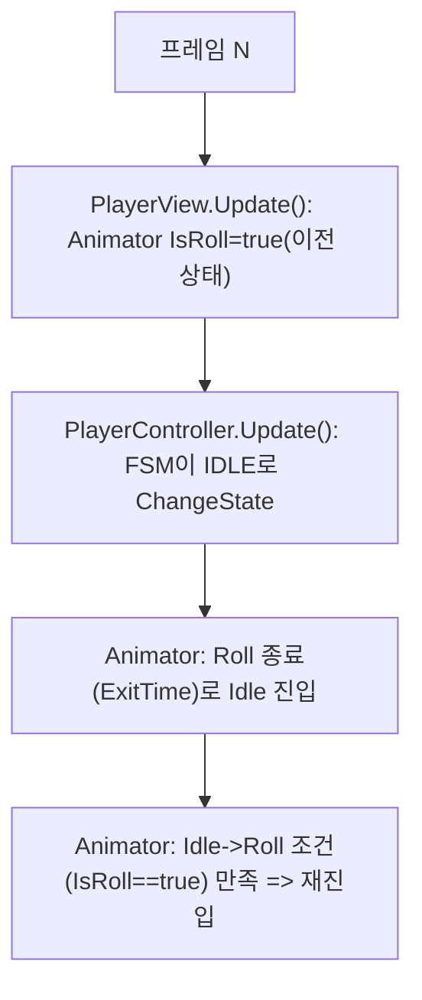
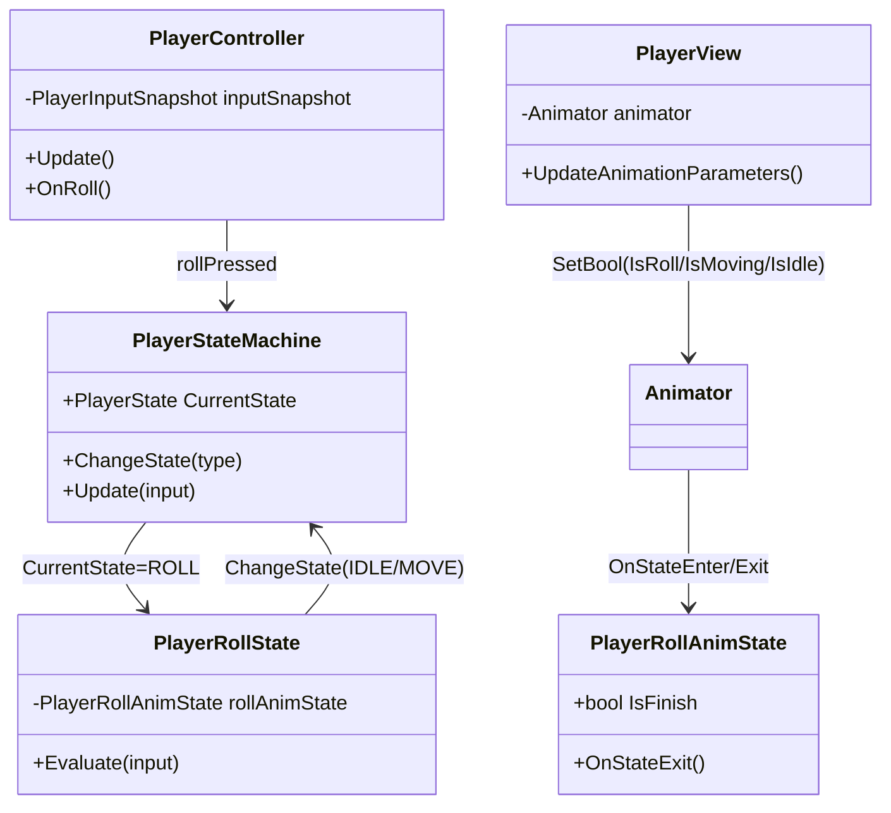

# [2026-04-22 15-24] us2d_client 스크립트 실행 순서 자동 설정(에디터 스크립트) 추가 (SDP)

## 0) 구현 목표 (요약)
- **목표**: Unity `Project Settings > Script Execution Order`에서 `PlayerController=1000`, `PlayerView=1999`를 **메뉴 한 번으로 자동 적용**.
- **배경**: 스크립트가 많아 수동 선택이 어려우므로, 에디터 스크립트에서 `MonoImporter.SetExecutionOrder`로 결정론적으로 설정.
- **상용 기준**: 신규 팀원/새 PC에서도 재현 가능하게 “도구화”하고, 누락 시 로그로 감지.

## 1) 설계(접근 방식)
- 파일은 사용자가 지정한 경로에 생성: `D:\Devs\us2d_client\Assets\Projects\Scripts\ScriptExecutionOrder.cs`
- 런타임 빌드에 포함되지 않도록 `#if UNITY_EDITOR` 가드로 Editor API를 감쌉니다.
- `MonoImporter.GetAllRuntimeMonoScripts()`를 순회하며 `GetClass()==typeof(T)`로 `MonoScript`를 찾아 적용(인스턴스 생성/부작용 방지).

## 2) 로직 흐름
1. Unity 메뉴 `Tools > Script Execution Order > Apply Player Order` 클릭
2. `PlayerController` 스크립트를 찾고 실행 순서 `1000` 적용
3. `PlayerView` 스크립트를 찾고 실행 순서 `1999` 적용
4. 성공/실패를 `Console`에 출력

## 3) 수정/생성 파일 (경로)
- 생성: `D:\Devs\us2d_client\Assets\Projects\Scripts\ScriptExecutionOrder.cs`

## 4) 구현 코드 (SDP에 전체 코드 포함)
대상: `D:\Devs\us2d_client\Assets\Projects\Scripts\ScriptExecutionOrder.cs`

```csharp
#if UNITY_EDITOR
using System;
using UnityEditor;
using UnityEngine;

public static class ScriptExecutionOrder
{
    [MenuItem("Tools/Script Execution Order/Apply Player Order")]
    private static void ApplyPlayerOrder()
    {
        Set<PlayerController>(1000);
        Set<PlayerView>(1999);

        Debug.Log("[ScriptExecutionOrder] Applied: PlayerController=1000, PlayerView=1999");
    }

    private static void Set<T>(int order) where T : MonoBehaviour
    {
        MonoScript monoScript = FindMonoScript(typeof(T));
        if (monoScript == null)
        {
            Debug.LogError($"[ScriptExecutionOrder] MonoScript not found: {typeof(T).FullName}");
            return;
        }

        MonoImporter.SetExecutionOrder(monoScript, order);
    }

    private static MonoScript FindMonoScript(Type type)
    {
        MonoScript[] scripts = MonoImporter.GetAllRuntimeMonoScripts();
        for (int i = 0; i < scripts.Length; i++)
        {
            MonoScript script = scripts[i];
            if (script == null) continue;

            if (script.GetClass() == type)
            {
                return script;
            }
        }

        return null;
    }
}
#endif
```

## 5) 테스트(수동)
- Unity에서 메뉴 실행 후 `Project Settings > Script Execution Order` 확인:
  - `PlayerController`가 `1000`
  - `PlayerView`가 `1999`

---

## 6) 승인 체크박스
- [ ] Update: SDP 내용/가정 수정 요청
- [ ] Modify: 위 경로로 에디터 스크립트 실제 생성 승인
- [ ] Test: 메뉴 실행 및 설정값 확인까지 진행 승인

---

# [2026-04-22 15-12] us2d_client 롤 종료 직후 Idle→Roll 재시작(재진입) 원인 분석 및 수정 (SDP)

## 0) 구현 목표 (요약)
- **증상**: 한번 구르기를 시작하면 **롤이 끝난 뒤 Idle로 갔다가 곧바로 다시 Roll을 시작**(=롤 애니가 연속으로 재시작되는 것처럼 보임).
- **목표**: Roll 종료 후 **입력(rollPressed)이 없으면 Roll 재시작이 절대 발생하지 않도록** 전이/파라미터를 결정론적으로 정리.

## 1) 현재 상태(확인된 사실)
### 1.1. AnimatorController 전이 구조(`AC_Player.controller`)
- `IsIdle` → `IsRoll` 전이 조건: `IsRoll == true` (ExitTime 없음)
- `IsMoving` → `IsRoll` 전이 조건: `IsRoll == true` (ExitTime 없음)
- `IsRoll` → `IsIdle` 전이: ExitTime=1, **조건 없음**
- `IsRoll` → `IsMoving` 전이: ExitTime=1, **조건 없음**

### 1.2. 파라미터 세팅 방식(`PlayerView`)
- `Update()`에서 매 프레임 `Animator.SetBool(IsIdle/IsMoving/IsRoll)`을 `player.StateMachine.CurrentState.StateType` 기준으로 설정.

## 2) 원인(가장 유력)
### 2.1. “한 프레임 stale” 파라미터로 인해 Idle에서 Roll이 재발동
Unity는 같은 프레임 안에서 `MonoBehaviour.Update()` 호출 순서가 고정 보장되지 않습니다(프로젝트 Script Execution Order를 따로 설정하지 않는 한).
- 어떤 프레임에서 Roll이 끝나며 `PlayerRollState.Evaluate()`가 `PlayerStateMachine.ChangeState(IDLE)`을 호출하더라도,
- 같은 프레임의 `PlayerView.Update()`가 **그보다 먼저 실행**되면,
  - `IsRoll` 파라미터는 그 프레임 동안 계속 **true(이전 상태 기준)** 로 남을 수 있습니다.
- 그 상태에서 Animator는 Roll→Idle(ExitTime)로 빠져나온 직후, Idle→Roll 조건(`IsRoll == true`)을 만족해 **곧바로 Roll을 다시 시작**할 수 있습니다.

즉, **게임플레이 FSM은 Idle로 복귀했는데, Animator 파라미터가 한 프레임 늦게 갱신되어** 애니메이션만 다시 롤로 재진입하는 현상입니다.

## 3) 수정 방안(권장 우선순위)
### 3.1. (권장 1) Script Execution Order를 코드로 고정
가장 작은 변경으로 “동일 프레임 내 순서”를 보장합니다.
- `PlayerController`가 `Update()`에서 FSM 업데이트를 먼저 수행
- `PlayerView`가 그 다음 `Update()`에서 Animator 파라미터 반영

구현:
- `PlayerController`에 `[DefaultExecutionOrder(-100)]`
- `PlayerView`에 `[DefaultExecutionOrder(100)]`

### 3.2. (권장 2) Animator 파라미터 업데이트를 `PlayerController.Update()`로 이동
View가 “게임 상태를 읽어 애니 파라미터를 쓰는” 시점을 명시적으로 FSM 업데이트 직후로 고정합니다.
- `PlayerView.Update()`에서는 Flip만 유지
- `PlayerController.Update()`에서 `player.StateMachine.Update(...)` 직후 `playerView.UpdateAnimationParameters()` 호출

### 3.3. (추가 안정화) `AC_Player.controller`의 Roll 종료 전이를 결정론적으로
현재 `IsRoll` 상태에 ExitTime=1 전이가 2개(`IsIdle`, `IsMoving`)인데 조건이 비어있어 결과가 비결정적일 수 있습니다.
- `IsRoll` → `IsMoving`: `IsMoving == true`
- `IsRoll` → `IsIdle`: `IsMoving == false`
- ExitTime=1 유지

## 4) 다이어그램(프레임 순서 문제)


## 5) 수정/생성 파일(경로)
- 수정(권장): `D:\Devs\us2d_client\Assets\Projects\Scripts\Gameplay\PlayerController.cs`
- 수정(권장): `D:\Devs\us2d_client\Assets\Projects\Scripts\Gameplay\PlayerView.cs`
- 수정(추가 안정화): `D:\Devs\us2d_client\Assets\Projects\Anims\Gameplay\AC_Player.controller`

## 6) 구현 코드(승인 후 실제 반영)
### 6.1. `DefaultExecutionOrder` 적용(권장 1)
대상: `D:\Devs\us2d_client\Assets\Projects\Scripts\Gameplay\PlayerController.cs`
```csharp
using UnityEngine;

[DefaultExecutionOrder(-100)]
public partial class PlayerController : MonoBehaviour, InputMappingContext.IPlayerActions
{
    // ...
}
```

대상: `D:\Devs\us2d_client\Assets\Projects\Scripts\Gameplay\PlayerView.cs`
```csharp
using UnityEngine;

[DefaultExecutionOrder(100)]
public class PlayerView : MonoBehaviour
{
    // ...
}
```

### 6.2. (옵션) Roll 종료 전이 조건화(추가 안정화)
대상: `D:\Devs\us2d_client\Assets\Projects\Anims\Gameplay\AC_Player.controller`
- `IsRoll -> IsIdle` 전이 조건: `IsMoving == false`
- `IsRoll -> IsMoving` 전이 조건: `IsMoving == true`

## 7) 테스트(수동)
- Roll 1회 입력 → Roll 완료 → Idle/Move 복귀 후 **Roll이 자동 재시작하지 않음**
- Roll 끝나는 순간에 이동 입력 유지/해제 두 케이스 확인

---

## 8) 승인 체크박스
- [ ] Update: SDP 내용/가정/다이어그램 수정 요청
- [ ] Modify: `PlayerController/PlayerView`(및 필요 시 `AC_Player.controller`) 실제 수정 승인
- [ ] Test: 유니티 플레이모드(수동) 테스트까지 진행 승인

---

# [2026-04-22 14-45] us2d_client 플레이어 구르기(ROLL) 애니메이션 “미재생/정지” 원인 분석 및 수정 (SDP)

## 0) 구현 목표 (요약)
- **증상**: 플레이 중 플레이어가 구르기 입력을 해도 **Roll 애니메이션이 안 보이거나**, 보이더라도 **프레임이 진행되지 않는 것처럼** 보임(=롤이 끝나지 않고 상태가 고착되는 느낌).
- **목표**: Roll 애니메이션이 **정상 재생/종료**되고, 종료 시 `PlayerStateMachine`이 `IDLE/MOVE`로 **정상 복귀**하도록 수정.
- **상용 기준**: “설정 실수로 롤이 영구 고착” 같은 장애가 나지 않게, **Animator 전이/파라미터 설계**를 결정론적으로 정리하고, 필요 시 **코드 fallback**도 준비.

## 1) 현상 관찰 체크(1분 컷)
아래 중 어느 케이스인지에 따라 원인이 갈립니다.
- (A) **Idle/Move 애니도 전부 안 보임** → Animator/Renderer/레이어/컨트롤러 자체 문제 가능성
- (B) **Idle/Move는 정상인데 Roll만 문제** → Roll 전이(AnyState) 또는 Roll 상태 자체 설정 문제 가능성 큼

※ 현재 프로젝트 파일 기준으로는 (B)가 더 유력합니다.

## 2) 현재 구조(코드) 요약
- 입력: `PlayerController`에서 `rollPressed` 1프레임 true → `PlayerIdleState/PlayerMoveState.Evaluate()`에서 `ROLL`로 전이.
- 뷰: `PlayerView.UpdateAnimationParameters()`에서 상태에 따라 Animator bool(`IsIdle/IsMoving/IsRoll`)을 **매 프레임 SetBool**.
- 롤 종료 감지: `PlayerRollState`가 `Animator.GetBehaviour<PlayerRollAnimState>()`의 `IsFinish`를 보고 `IDLE/MOVE`로 전이.

## 3) 원인 분석(가장 유력한 1순위)
### 3.1. `AC_Player.controller`의 AnyState→Roll 전이가 “자기 자신(Roll)으로도 전이 가능”하게 설정됨
`Assets/Projects/Anims/Gameplay/AC_Player.controller`에서:
- AnyState→Roll 조건은 `IsRoll == true`
- 그런데 `PlayerView`는 플레이어가 `ROLL` 상태인 동안 `IsRoll`을 **계속 true**로 유지
- 게다가 AnyState 전이의 `Can Transition To Self`가 켜져 있으면(=자기 자신으로도 전이 가능),
  - Roll 상태에 들어간 직후에도 **매 프레임 AnyState→Roll이 다시 발동**
  - 결과적으로 Roll이 매 프레임 재진입(리셋)되어 **normalizedTime이 1.0에 도달하지 못하고**, `OnStateExit`가 기대대로 발생하지 않거나(혹은 계속 리셋) “진행이 안 되는 것처럼” 보일 수 있습니다.
  - 그러면 `PlayerRollAnimState.IsFinish`도 true가 되지 않아 `PlayerRollState`가 빠져나가지 못해 **FSM도 고착**될 수 있습니다.

### 3.2. Roll→Idle / Roll→Move 전이가 “조건이 비어있어” 비결정적
현재 Roll state에는 (ExitTime=1)인 전이가 **2개** 있는데 조건이 둘 다 비어있습니다.
- Roll이 끝난 뒤 어디로 갈지(Idle/Move)가 컨트롤러 내부 순서/평가에 따라 달라질 수 있어 디버깅이 어려워집니다.

## 4) 수정 방안(권장: 설정 수정이 1순위, 코드 수정은 2순위)
### 4.1. (필수) AnyState→Roll 전이에서 `Can Transition To Self`를 끔
- Roll 상태에서 `IsRoll`이 계속 true여도, **Roll→Roll 재진입**이 막혀 애니메이션이 정상 진행합니다.

### 4.2. (필수) Roll→Idle / Roll→Move 전이에 조건을 부여
- Roll→Move: `IsMoving == true`
- Roll→Idle: `IsMoving == false`
- ExitTime(=Roll 애니 1회 재생 후 종료)은 유지.

### 4.3. (선택, 상용 안정성) 코드 fallback 추가
Animator 설정이 다시 잘못되더라도 “롤 영구 고착”은 막아야 합니다.
- `PlayerRollState`에서 `rollAnimState == null` 또는 일정 시간(예: 0.8s) 초과 시 **강제 종료**(Idle/Move)로 빠져나오기.

## 5) 다이어그램(클래스/흐름)
### 5.1. 클래스 구조(요약)


### 5.2. 로직 흐름(문제 케이스 포함)
```mermaid
flowchart TD
  I[입력: Roll] --> C[PlayerController: rollPressed 1프레임]
  C --> S0[PlayerStateMachine: ROLL 전이]
  S0 --> V[PlayerView: IsRoll=true 매 프레임]
  V --> A[Animator: AnyState->Roll (IsRoll 조건)]
  A -->|CanTransitionToSelf=ON| A2[Roll->Roll 재진입 반복(리셋)]
  A2 --> F0[Roll 애니 진행/종료 불가처럼 보임]
  F0 --> F1[PlayerRollAnimState.IsFinish=true 안 됨]
  F1 --> F2[PlayerRollState.Evaluate: ROLL에서 못 빠짐]
```

## 6) 수정/생성 파일(경로)
### 6.1. 실제 수정(권장)
- 수정: `D:\Devs\us2d_client\Assets\Projects\Anims\Gameplay\AC_Player.controller`

### 6.2. 선택(안정성 강화)
- 수정: `D:\Devs\us2d_client\Assets\Projects\Scripts\Gameplay\Creature\States\PlayerRollState.cs`

## 7) 구현 코드(적용 예정 패치; 승인 후 실제 반영)
### 7.1. `AC_Player.controller` (AnyState→Roll self 전이 차단 + Roll 종료 전이 조건화)
대상: `D:\Devs\us2d_client\Assets\Projects\Anims\Gameplay\AC_Player.controller`

#### (1) AnyState→Roll 전이: `m_CanTransitionToSelf: 1` → `0`
```diff
--- !u!1101 &-1951435611704114310
 AnimatorStateTransition:
@@
-  m_CanTransitionToSelf: 1
+  m_CanTransitionToSelf: 0
```

#### (2) Roll→Idle 전이(ExitTime 유지 + `IsMoving == false`)
```diff
--- !u!1101 &-8966140963237354498
 AnimatorStateTransition:
@@
-  m_Conditions: []
+  m_Conditions:
+  - m_ConditionMode: 2
+    m_ConditionEvent: IsMoving
+    m_EventTreshold: 0
```

#### (3) Roll→Move 전이(ExitTime 유지 + `IsMoving == true`)
```diff
--- !u!1101 &-5285520995236260385
 AnimatorStateTransition:
@@
-  m_Conditions: []
+  m_Conditions:
+  - m_ConditionMode: 1
+    m_ConditionEvent: IsMoving
+    m_EventTreshold: 0
```

### 7.2. (선택) `PlayerRollState` fallback(롤 고착 방지)
대상: `D:\Devs\us2d_client\Assets\Projects\Scripts\Gameplay\Creature\States\PlayerRollState.cs`

핵심 아이디어:
- `Enter()`에서 `rollStartTime = Time.time;`
- `Evaluate()`에서
  - `rollAnimState != null && rollAnimState.IsFinish`면 정상 종료
  - 아니면 `Time.time - rollStartTime >= RollMaxDurationSeconds`면 강제 종료(Idle/Move)

```diff
 public class PlayerRollState : PlayerState
 {
     private PlayerRollAnimState rollAnimState;
+    private float rollStartTime;
+    private const float RollMaxDurationSeconds = 0.8f;
@@
     public PlayerRollState(Player player) : base(player, PlayerStateType.ROLL)
     {
         rollAnimState = Utls.FindComponent<Animator>(player.gameObject).GetBehaviour<PlayerRollAnimState>();
     }
+
+    public override void Enter()
+    {
+        rollStartTime = Time.time;
+    }
@@
     public override void Evaluate(PlayerInputSnapshot input)
     {
-        if (rollAnimState.IsFinish == true)
+        bool isRollFinished = rollAnimState != null && rollAnimState.IsFinish;
+        bool isTimeout = Time.time - rollStartTime >= RollMaxDurationSeconds;
+
+        if (isRollFinished || isTimeout)
         {
             Player.StateMachine.ChangeState(input.move.IsNearlyZero() ? PlayerStateType.IDLE : PlayerStateType.MOVE);
             return;
         }
     }
 }
```

## 8) 테스트(수동) 시나리오
- (1) Idle에서 Roll → Roll 애니가 **끝까지 진행** 후 Idle 복귀
- (2) Move 중 Roll(이동 입력 유지) → Roll 애니 진행 후 Move 복귀
- (3) Roll 연타 → 애니가 매 프레임 리셋되지 않고, 기대 동작(쿨타임/연타 정책)에 맞게 동작
- (4) 콘솔에 Animator 파라미터 미존재 경고/NullRef가 없는지 확인

## 9) 리스크/롤백
- 애니 컨트롤러(YAML) 수정은 머지 충돌이 잦습니다 → 수정 후 `AC_Player.controller`만 단독 커밋/PR로 분리 권장.
- 롤백은 `AC_Player.controller`를 수정 전 버전으로 되돌리면 됩니다.

---

## 10) 승인 체크박스
- [ ] Update: SDP 내용/가정/다이어그램 수정 요청
- [ ] Modify: 위 수정안(AnimatorController 및 선택 코드) 실제 반영 승인
- [ ] Test: 유니티 플레이모드(수동) 테스트까지 진행 승인
